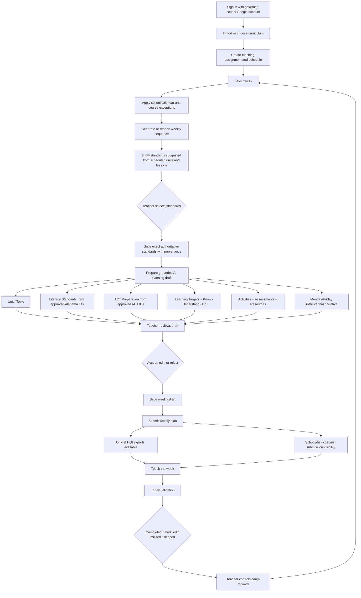

# Teacher Planning Platform — Teacher Flow Design

**Status:** Pilot design baseline for browser acceptance  
**Date:** August 2026  
**Scope:** Adult educator and administrator professional planning data only

## Purpose

The Teacher Planning Platform should reduce the repetitive administrative work around lesson
planning without taking instructional judgment away from the teacher. The platform should reuse
information it already has instead of asking teachers to re-enter the same information in multiple
places.

The target experience is:

> **Curriculum → course schedule → school week/calendar → relevant authoritative standards →
> grounded planning draft → teacher review/edit → save/submit → Friday validation/carry-forward**

## Teacher-research findings that shape the flow

A pre-pilot Anniston City Schools lesson-planning survey produced 14 responses. The raw response
export is retained outside the product repository because it contains respondent information; only
aggregate product findings are recorded here.

Key aggregate findings:

- 11 of 14 respondents identified completing the district lesson plan as one of their three most
  time-consuming planning tasks.
- Automatic standards insertion received a 4.43/5 average value rating.
- Automatic completion of the district lesson-plan format received a 4.36/5 average value rating.
- A reusable lesson library and weekly reflections each received a 4.29/5 average value rating.
- Standards coverage tracking received a 4.21/5 average value rating.
- Automatic next-week scheduling and pacing tracking each received a 4.07/5 average value rating.
- 13 of 14 respondents indicated willingness to test an early version.
- 10 of 14 respondents indicated willingness to demonstrate their current planning process in a
  short follow-up session.
- When instruction is interrupted, the most common response was that what happens next depends on
  the situation. That supports explicit teacher-controlled Friday validation rather than an
  automatic assumption that every interrupted lesson must move forward.

Qualitative themes consistently favored a system that places known information into the required
planning format, reduces repeated formatting/data entry, keeps standards close to the planning
workflow, supports reuse, and integrates the planning steps into one coherent process.

## Design principles

1. **Enter information once.** Curriculum sequence, schedule, standards mapping, and school calendar
   should be reused downstream.
2. **The teacher owns instructional judgment.** TPP may organize, suggest, unpack, and draft; the
   teacher decides what becomes the plan.
3. **One pacing lesson equals one class day.** The configured period/block schedule supplies that
   day&apos;s instructional minutes. Pacing rows are not split across meetings or combined within a day.
4. **Standards should be relevant before they are exhaustive.** The weekly screen should surface
   likely standards based on the imported lessons actually scheduled that week while preserving
   searchable access to the full approved course catalog.
5. **Authoritative wording remains authoritative.** Relevance ranking is deterministic. Generative
   AI never fabricates or rewrites authoritative Alabama, Army JROTC, or ACT wording.
6. **AI should start the form, not become another task.** Once standards are selected, TPP should
   prepare a complete teacher-reviewable planning draft instead of leaving a mostly blank form.
7. **AI remains draft assistance.** No AI-generated planning content becomes saved authoritative
   teacher content or an official export without explicit teacher acceptance/editing.
8. **No student data.** The workflow is for teacher, curriculum, standards, schedule, validation,
   reflection, submission, and related professional operational information only.

## End-to-end flow

## 1. Curriculum setup

A curriculum establishes the instructional sequence. Normal lesson rows contain:

`Unit | Lesson | Standards | Learning targets | Assessment`

Each row represents one day the class meets. Weekly planning uses the instructional time from the
teaching assignment&apos;s meeting pattern for that date. The importer continues to recognize earlier
pilot workbooks, but any historical lesson-minute column is ignored so old files cannot reintroduce
multi-day splitting.

## 2. Course schedule

The teaching assignment supplies the normal instructional-time contract:

- period, block, or custom schedule;
- meeting weekdays;
- start/end times;
- effective dates;
- rotation label where applicable.

One scheduled lesson consumes the eligible class day and uses that day&apos;s available instructional
minutes. The next curriculum lesson advances to the next eligible instructional day.

## 3. Weekly schedule and exceptions

The weekly plan combines curriculum sequence, meeting pattern, school calendar, assignment-specific
exceptions, and the previous Friday validation. A missed or modified week therefore does not require
the teacher to rebuild the course sequence manually.

## 4. Weekly standards

The standards screen should not begin with the complete course corpus as one undifferentiated list.
Instead it should show:

- the mapped authoritative course and source provenance;
- the imported units/lessons actually scheduled for the selected week;
- **Suggested for this week**, ranked deterministically from those unit/lesson titles against the
  exact approved standard text;
- already-selected standards even when they are not in the top relevance results;
- a searchable and grouped **Browse all approved standards** section.

The relevance layer is an aid only. It never removes the teacher's ability to select another
approved course standard.

## 5. Integrated planning draft

Saving at least one weekly standard prepares a grounded planning draft from:

- selected exact authoritative standards and provenance;
- the imported unit and lesson titles scheduled for the week;
- imported learning targets, Know/Understand/Do content, activities, assessments, and resources when
  those fields exist;
- the course/grade context;
- the teacher's current nonblank planning text;
- approved Alabama ELA recurring-literacy standard candidates;
- the governed first-party ACT reference catalog.

The planning draft covers:

- Unit / Topic;
- Literacy Standards;
- ACT Preparation;
- Learning Targets;
- Know;
- Understand;
- Do;
- Activities;
- Assessments;
- Resources;
- Monday, Tuesday, Wednesday, Thursday, and Friday instructional narrative.

### Standards integrity inside the AI workflow

Content-standard text is supplied to AI as immutable reference text. The model may unpack the
standard into Learning Targets and Know/Understand/Do instructional interpretations, but those
interpretations are not represented as authoritative standards.

For Literacy Standards, AI may recommend only bounded IDs from the approved Alabama ELA recurring
standards supplied by the server. The server resolves those IDs to exact approved wording. Unknown
or unapproved IDs fail closed.

ACT Preparation follows the same governed pattern already established for ACT: AI may recommend only
approved candidate IDs, and the server resolves the authoritative wording.

## 6. Teacher review

Generated planning content is presented as **AI draft suggestion — not saved**. The teacher may:

- accept a suggestion as written;
- edit and apply the revised version;
- reject it; or
- use **Apply full planning draft** as an explicit bulk acceptance action after reviewing/editing the
  displayed draft.

Bulk application still records a field-level accepted/edited decision before applying nonblank
content to the working form. The teacher can continue editing the working form before saving.

## 7. Save, submit, and export

Saving creates or updates the working weekly draft. Submission is a separate intentional teacher
action. The submitted revision is preserved in immutable submission history for professional
administrative oversight.

Official HQI exports are available only for the current submitted revision. Editing after submission
returns the working plan to a revised-after-submission state until the teacher saves and resubmits.

## 8. Friday validation

Friday validation records what actually happened for each scheduled lesson:

- completed;
- modified;
- missed;
- skipped / not needed.

The teacher controls the instructional consequence. Missed instruction can carry forward and the
next generated week preserves course sequence without forcing a one-size-fits-all response to every
interruption.

## 9. Administrative visibility

School administrators receive school-scoped professional submission visibility. District
administrators receive district-scoped professional submission reporting across governed schools.
The submission record concerns teacher planning operations only; TPP does not introduce student
records or student-level reporting.

## Documentation closeout

After this flow passes browser acceptance, the release documentation set will be finalized as:

1. **Standards Catalog Overview** — high-level explanation of the authoritative standards sources,
   catalogs, counts, provenance, and governance model imported for the pilot.
2. **Teacher Survey Findings** — aggregate findings and the product decisions they informed; no
   respondent names/emails in the development documentation.
3. **Teacher Flowchart** — a print-friendly version of the end-to-end flow above.
4. **Volunteer Teacher Guide** — rewrite `docs/VOLUNTEER_TEACHER_PILOT_GUIDE.md` from the final tested
   browser workflow, optimized for printing and use beside the application.

The existing volunteer-teacher guide should not be treated as current for the redesigned flow until
that rewrite is completed after browser acceptance.
